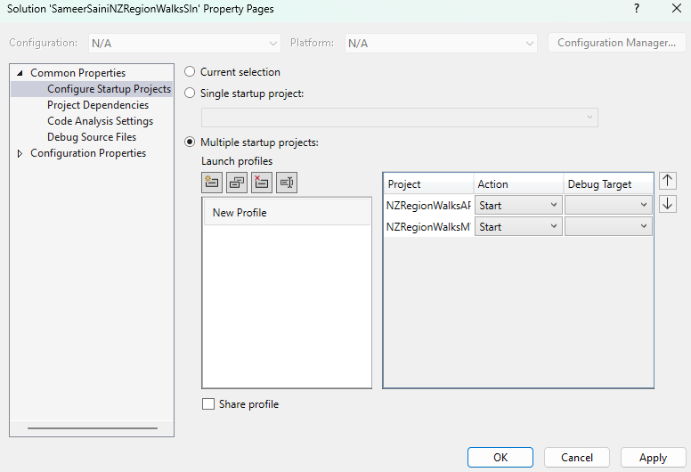

Here is what we did in this branch:  

- Here, we are ready to create an ASP .NET MVC Template to consume our already built Web API.
- Within our soultion, we can create a new project of MVC Template.
- To enable both our projects to run concurrently so that the MVC can communicate with the API project: 
    - Right click on Solution  
    - Click on Properties
    - Select the `Configure Startup Projects`
    - Select both the *MVC* and *API* projects' Action as `Start`
    - Click on `Apply`.
- Ensure the `Solution Configuration` dropdown is on `Debug`.
- The above steps will ensure both projects are opened in different browsers (web pages) when you run the app.

- The above steps isn't a right fit for us because we are `git tracking` and documenting on `Github`. In order to ensure a proper flow between both projects (in our case), we would create a new separate Solution and Project called `NZRegionWalksMVC`.